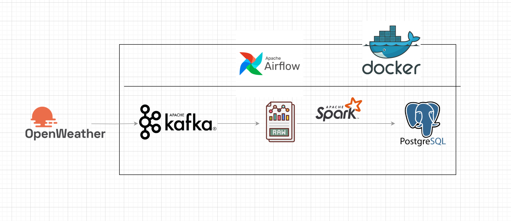

# OpenWeatherMap Data Pipeline

This project implements a weather data ETL pipeline using Apache Airflow, Apache Spark, Kafka, and PostgreSQL. It fetches weather data from the OpenWeatherMap API for multiple cities, ingests it into Kafka, processes it with Spark, and stores the results in a PostgreSQL database. The system is containerized using Docker Compose.

## Architecture Overview

- **Airflow DAGs** (`airflow/dags/`):
  - `batch_weather_data.py`: Main ETL DAG. Runs a Python task to fetch weather data and a Spark job to process it.
  - `weather_producer.py`: Contains `WeatherProducer`, which fetches weather data from the API and sends it to Kafka.
- **Spark Jobs** (`spark/`):
  - `main.py`: Consumes weather data from Kafka, transforms it, and writes to PostgreSQL. Handles offset checkpointing in `checkpoint/last_offsets.json`.
  - `transform.py`, `spark_utils.py`: Define schema and transformation logic for weather data.
- **Docker Compose** (`docker-compose.yaml`):
  - Orchestrates Airflow, Spark, Kafka, PostgreSQL, and Redis containers. Mounts code and checkpoint files into containers.

## File Structure
```
weather_data/
├── airflow/
│   ├── dags/
│   │   ├── batch_weather_data.py
│   │   └── weather_producer.py
│   └── ...
├── spark/
│   ├── main.py
│   ├── transform.py
│   ├── spark_utils.py
│   └── checkpoint/last_offsets.json
├── docker-compose.yaml
├── Dockerfile
├── requirements.txt
└── .env
```

## Getting Started

### Prerequisites
- Docker & Docker Compose.
- OpenWeatherMap API key (set in `.env`). Get it from [here](https://home.openweathermap.org/api_keys)

### Setup & Run
1. Clone the repository and navigate to the project directory
2. Add your OpenWeatherMap API key and user id of Airflow to a `.env` file:
   ```env
   OPENWEATHER_API_KEY=your_api_key_here
   AIRFLOW_UID=50000
   ```
3. Build and start the services:
   ```sh
   docker-compose up -d --build
   ```
4. Access UIs:
   - Airflow: [http://localhost:8082](http://localhost:8080)
   - Kafka UI: [http://localhost:8080](http://localhost:8080)
   - Spark UI: [http://localhost:8081](http://localhost:8081)


